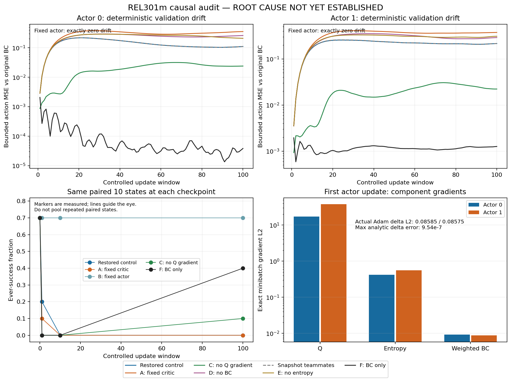

# Root-cause audit of early BC → MASAC actor collapse

**ROOT CAUSE NOT YET ESTABLISHED.** The exact critic gradients cause much of the early deterministic action drift, but removing them does not preserve the paired BC success rate. Removing actor entropy also fails; even BC-only actor updates transiently collapse success and end below the frozen BC reference. No single mechanism yet accounts for all observed failures. No implementation bug has been demonstrated and no production learner fix or hyperparameter change is applied.



## Source, inputs and executed commands

This continues `codex/stabilize-baseline-repro` from `801c8a8463a8e6c9775bce32f5dc24e0dd5e8748`. Production `masac.py`, networks, replay sampler, training loop, wrapper, warm-start, environment and fine-tune configs remain byte-identical to that commit. Reward, native success, horizon 200, observations 66/agent, actions 7/agent, critic state 119, network architecture, gamma .99, tau .005, both learning rates 3e-4, lambda_BC .5, std schedule and demo ratio are unchanged.

- Capture and original A/B/C/D/restored/snapshot forks: `c5aed081a702589642dec1432285c9bc88ee31d7`.
- Additional E/F objective diagnostics: `2c889cfe0335a11189a808cb1f64716c087f9416`.
- Final test tree: `7379e522cf2bffb806a0bf16e35dc940d9dd3c45`.
- Historical source/reference: `experiments/phase3/bc_finetune_10k_seed0`; BC input `experiments/phase3/bc_seed42/best.pt`, SHA `8e88e30e4d9ec87a462596a46c7aa5fd1e83d7ac51b0bfcfd3f595c380273979`.
- New local outputs: `experiments/phase3/root_cause_20261002_seed0/`. The pre-actor checkpoint is `trace/before_first_update.pt`: env step 1,000, Q count 2,000, both actor counts 0 and alpha count 0. It is saved **before** the env-1001 Q update; the actual first actor gradients see Q count 2,001.

Commands executed from the repository root, on the source revisions above:

```bash
PYTEST_DISABLE_PLUGIN_AUTOLOAD=1 .venv-phase3/bin/python -I -m pytest -q tests

.venv-phase3/bin/python -I -u -m rel301m.training.causal_audit \
  --config configs/experiment/stabilize_repro.yaml \
  --output-root experiments/phase3/root_cause_20261002_seed0 --phase capture

# At c5aed08 this ran restored, A, B, C, D and snapshot.
.venv-phase3/bin/python -I -u -m rel301m.training.causal_audit \
  --config configs/experiment/stabilize_repro.yaml \
  --output-root experiments/phase3/root_cause_20261002_seed0 --phase analyze

# At 2c889cf: isolate residual failures after removing Q.
.venv-phase3/bin/python -I -u -m rel301m.training.causal_audit \
  --config configs/experiment/stabilize_repro.yaml \
  --output-root experiments/phase3/root_cause_20261002_seed0 --phase analyze \
  --variants E_no_entropy F_BC_only
```

The current CLI defaults to all eight forks. A fresh repeat uses `--phase all` with a **new** output root; repeating analyze into existing fork directories fails rather than overwriting them. Capture runs 2k environment steps; each fork runs exactly 100 recorded replay update cycles. It is not exact online continuation: forks consume the baseline's recorded transitions rather than collecting new data with their altered policies. Progress/ETA covers training and evaluation stages. Known optional Panda notices are filtered; simulator exceptions remain visible.

## Exact tracing and RNG neutrality

The observer is installed only by `causal_audit.py`; normal `training.train` never selects these patches or diagnostic objectives. Replay sample indices are predicted using a copied NumPy generator state. Component derivatives use `autograd.grad` on the **existing loss graph**, without resampling actions, stepping an optimizer or assigning `.grad`. Hooks record the original forward outputs. CPU/CUDA RNG states are stored before each learner update.

All 100 updates of both actors are captured: 200 records in [actor_updates.jsonl](evidence/root_cause_actor_collapse/actor_updates.jsonl). Each contains actor and critic hashes, full batch/demo hashes, component loss/gradient metrics, per-parameter and mean/std/first-hidden norms, actual Adam displacement, Adam-state hashes, alpha, log_std, action means/std/saturation, train/validation expert MSE and BC drift. Local `trace/actor_NNN_i.pt` contains full before/after parameters, Adam states and component gradient vectors. `trace/update_NNN.pt` contains the full actual critic/demo batches and RNG state. Milestone checkpoints are saved after updates 1, 2, 5, 10, 20, 50 and 100.

The instrumented run's **model and all optimizer states** are bitwise identical to historical checkpoints at env steps 1,000 and 2,000. The restored replay-only fork is bitwise identical to the captured model at update 100 (env 1,100). The paired deterministic reference remains return 30.848067, ever-success 7/10, final-success 2/10. At 2k the unchanged reproduction returns 2.172557 and 0/10 ever/final success. All comparisons are recorded in [results.json](evidence/root_cause_actor_collapse/results.json).

First exact batch hashes, shared by both agent updates:

```text
critic batch cf3a9d13d59d398ef7aad8722babb0e51955a1c09c0aa934a0cd973525aa8f9e
BC batch     ab7182e84ca0bccbb770f1662878fe52aa4eba900a8a5763053d3e95dacfa02b
post-Q critic parameters
             246dd72d84e4abc3f9430022db59f8df02d6d07dcc6c8fcf71c23635e249f352
```

[batch_provenance.jsonl](evidence/root_cause_actor_collapse/batch_provenance.jsonl) records indices, source labels, batch hashes, RNG hashes and effective composition for every update. Hashing includes field names, tensor dtype, shape and values; it is not a hash of the `.pt` container format.

## Exact gradients and actual Adam steps

Measured loss components are `-min(Q1,Q2)`, `alpha*log_pi`, and the existing `.5*MSE(bounded_mean, expert)`. Teammate actions are the actual samples used by the historical sequential update. Combined-gradient agreement with the actual `.grad` tensors has **zero L2 error** across all 200 records.

| Update | Agent | Q gradient L2 | Entropy gradient L2 | Weighted BC gradient L2 | cos(Q, BC) | Actual Adam delta L2 | Validation BC drift |
| ---: | ---: | ---: | ---: | ---: | ---: | ---: | ---: |
| 1 | 0 | 17.290174 | .419352 | .009193 | .2680 | .085847 | .002851 |
| 1 | 1 | 37.810661 | .555632 | .008752 | .3145 | .085746 | .003536 |
| 2 | 0 | 16.618636 | .470189 | .177946 | −.9695 | .079665 | .011099 |
| 2 | 1 | 34.175777 | .669101 | .198334 | −.8903 | .079208 | .013584 |
| 5 | 0 | 6.795729 | .536043 | .692486 | −.9178 | .069929 | .059978 |
| 5 | 1 | 12.363778 | .845458 | .727363 | −.8722 | .068179 | .070658 |
| 10 | 0 | 1.444096 | .632386 | .828587 | −.9027 | .048467 | .149898 |
| 10 | 1 | 2.950900 | .939035 | .907178 | −.8056 | .047413 | .173778 |
| 20 | 0 | .712427 | .681920 | .792081 | −.8455 | .031399 | .216062 |
| 20 | 1 | 1.486524 | .766573 | .952327 | −.7385 | .028799 | .253421 |
| 50 | 0 | .708747 | .459220 | .482547 | −.8886 | .028056 | .145671 |
| 50 | 1 | 1.152454 | .717507 | .509456 | −.9038 | .021593 | .230292 |
| 100 | 0 | .670525 | .328900 | .441199 | −.9341 | .026894 | .109910 |
| 100 | 1 | .895014 | .559027 | .429675 | −.8087 | .020900 | .215775 |

At update 1, loss scalars Q / entropy / weighted BC are 3.870038 / .516911 / .000102 for agent 0, and 3.544415 / .592145 / .000177 for agent 1. Q gradients initially align with the small expert-correction gradient in parameter space; **do not claim universal opposition from the first update**. At update 2 they strongly oppose the now-restoring BC gradient. The trace classifies cosines above .1 as aligned, below −.1 as opposed and the interval between as nearly orthogonal; these are descriptive labels, not statistical tests. All pairwise Q/entropy/BC cosines and per-layer norms are saved.

At update 1, Q first-hidden / final-mean / final-std gradient norms are 1.193655 / 16.908205 / 0 for actor 0 and 2.403570 / 37.005437 / 0 for actor 1. The largest actual parameter displacement is instead the second hidden weight matrix: .075144 / .075035. Raw gradient norm is therefore not an additive attribution of Adam's displacement. Actual delta cosine with BC descent at update 10 is −.2054 / −.2021; at update 100 it remains slightly negative, −.0457 / −.0337, even though the current total-gradient/BC cosines are positive. Preconditioning and accumulated moments matter.

Adam uses fresh empty actor state before the first RL step, lr exactly 3e-4, betas (.9,.999), eps 1e-8, no scheduler and no accumulation. Analytic `m_t`, `v_t`, bias correction and parameter rounding match the actual tensor displacement; maximum error across the first 100 updates of both actors is **9.536743e-7**. Actor gradients are clean before backward; teammate and critic `.grad` remain absent during actor steps. Target critics receive no gradients. Fixed-std rows have zero total gradient throughout this window. Regression tests cover these properties, including a changed-critic invariance test for fork C.

## Pre-update critic ranking and extrapolation evidence

The ranking uses 128 fixed **train-only** demonstration states and the Q checkpoint before the first learner update. Every row includes expert/BC/stochastic/post-update actions, Q1/Q2/min Q and all three joint-action derivatives. See [critic_action_rows.csv](evidence/root_cause_actor_collapse/critic_action_rows.csv).

| Action variant | Mean min Q | MSE to expert | Fraction Q above BC mean |
| --- | ---: | ---: | ---: |
| Expert | −3.136282 | 0 | .609375 |
| BC deterministic | −3.131949 | .000282 | reference |
| Raw BC stochastic | −4.266227 | .361405 | .375000 |
| Configured std −3 stochastic | −3.142019 | .002236 | .453125 |
| Actor after 1 | −2.347268 | .003959 | 1.000000 |
| Actor after 10 | 1.304787 | .180470 | 1.000000 |
| Actor after 100 | 1.190902 | .178709 | 1.000000 |

The frozen initial critic prefers all 128 generated post-update actions to BC despite larger expert error and worse paired policy success. This is evidence of harmful action ranking outside the demonstrated neighborhood, **not** proof of absolute Q overestimation or an incorrect Bellman implementation.

[Controlled perturbations](evidence/root_cause_actor_collapse/critic_perturbation_rows.csv) hold the other agent at BC mean. Epsilon values .001/.01/.05/.1 use normalized directions toward/away from expert, dQ/da, exact first-update Q-parameter descent mapped through the actor Jacobian, actual action deltas at updates 1/10/100 and two seeded random directions. Bounds are clipped and actual displacement recorded. The Jacobian direction uses the exact update-1 gradient from the post-Q-step critic, while ranking uses the pre-update critic; these timings are explicit.

For the exact Q-gradient direction, Q increases on 128/128 states for both agents at every epsilon. At epsilon .05, Q increases while expert MSE worsens on 127/128 and 128/128 states; mean Q changes are +.100320 / +.179355. At epsilon .001 that joint condition holds on only 53/128 for each actor. Thus the data also show the importance of finite step size; an infinitesimal expert-correction direction is not universally harmful.

Discounted teacher return-to-go is computed per train episode with gamma .99 and no cross-episode continuation. Its mean on these states is 41.500549 versus BC min Q −3.131949. The difference is **not a calibrated value error**: finite G omits the unknown time-limit bootstrap and entropy rewards, and follows the successful teacher rather than the stochastic SAC continuation policy. This limitation is especially material near horizon. No true off-manifold soft-policy return has been measured.

## Replay composition: direct source fraction versus actual demos

Main replay retains 6,000 train demos and grows with online policy transitions; no ring overwrite occurs in this 2k window. Sampling remains unchanged. Source identity is `(demo, original_episode, timestep)` or `(online, training_episode, timestep)` and detects duplicates across the retained/main buffers.

| Env step | Main demos / online | Configured direct fraction | Actual critic demos / online | Effective demo fraction | Duplicate fraction |
| ---: | --- | ---: | --- | ---: | ---: |
| 0 | 6000 / 0 | .750 | 256 / 0 | 1.000000 | .023438 |
| 100 | 6000 / 100 | .745 | 253 / 3 | .988281 | .011719 |
| 500 | 6000 / 500 | .725 | 254 / 2 | .992188 | .035156 |
| 1000 | 6000 / 1000 | .700 | 240 / 16 | .937500 | .015625 |
| 1100 | 6000 / 1100 | .695 | 249 / 7 | .972656 | .011719 |
| 2000 | 6000 / 2000 | .650 | 233 / 23 | .910156 | .019531 |

These are the **actual individual batches** at those steps, not averaged fractions. Step 0 is an offline pretraining batch drawn wholly from retained demos; configured mixed ratio is not used there. [replay_composition.json](evidence/root_cause_actor_collapse/replay_composition.json) includes sample indices and complete unique-episode distributions. This matches the documented retained-source fraction, but does not implement an exact expert/online ratio. No sampling correction is applied. A regression verifies effective source fraction and duplicate identity across prefilled/direct samples.

## Transition alignment and normalization

Tests compare all replay fields to the original train trajectory for first/last and seeded random transitions in every training episode, assert current/next continuity and final-only done/timeout, and reject a deliberately corrupted next state. Two full original train episodes are regenerated with the saved scripted teacher/seed, asserting current observations/state, actions, reward, next observations/state and done/timeout at every timestep. This directly checks action labels against the current timestep rather than only comparing array shapes.

The saved manifest declares raw Phase-2 observations. The BC checkpoint declares normalization folded into its first Linear layer. Reconstructed normalized-actor inference matches exported raw-input actions within the regression tolerance; live teacher observations match saved raw observations. No inference normalization mismatch is found. These tests do **not** establish that Adam optimization of folded weights is equivalent to optimization in the original normalized parameterization.

## Controlled forks and paired evaluation

All forks start from identical model state, Q/actor/alpha optimizer states and schedules. Each restores the exact recorded CPU/CUDA Torch RNG before using the recorded critic and BC batches. A consumes target-policy draws even though it skips Q updates. Alpha updates remain enabled when actors update; B freezes alpha with actors. Snapshot changes only the teammate policy used in actor losses. Each checkpoint is evaluated on the same ten seed-20,000 states, SHA `19841a3401962f77201c881bd1c5865b19aa9a104e7c42c02926d6ccedfd7721`. Repeated evaluations are paired observations, not independent additional episodes.

| Fork | Intervention | Ever-success after 1 / 10 / 100 | Final-success after 100 | Validation drift 0 / 1 after 100 |
| --- | --- | --- | --- | --- |
| Restored | Original objective/order | 2/10 / 0/10 / 0/10 | 0/10 | .109910 / .215775 |
| A | Permanently fixed Q and targets | 1/10 / 0/10 / 0/10 | 0/10 | .352605 / .375843 |
| B | Fixed actors/alpha; Q updates | 7/10 / 7/10 / 7/10 | 2/10 | 0 / 0 |
| C | Remove only Q actor gradient | 0/10 / 0/10 / 1/10 | 0/10 | .023852 / .022274 |
| D | Remove only auxiliary BC term | 3/10 / 0/10 / 0/10 | 0/10 | .258959 / .291004 |
| Snapshot | Pre-update teammate for both losses | 2/10 / 0/10 / 0/10 | 0/10 | .110016 / .215914 |
| E | Remove only actor entropy gradient | 2/10 / 0/10 / 0/10 | 0/10 | .207587 / .310471 |
| F | BC-only actor gradient | 0/10 / 0/10 / 4/10 | 1/10 | .000038 / .001264 |

E/F were added because C did not preserve BC success. They are diagnostic objective removals, not new proposed algorithms. Q/targets and alpha still update normally in F; only the actor objective is BC-only. Critic Bellman targets retain entropy terms in C/E/F. No hyperparameter is changed.

A verifies fixed-critic sufficiency for collapse; moving targets are unnecessary. B retains the exact original policy. With B, dQ/da norm at BC changes from 2.202852 / 3.737679 after cycle 1 to 1.586375 / 3.301307 after cycle 100, while cosine with the recorded collapse direction remains .642585 / .857569 at cycle 100. Continuing critic training does not remove that directional preference. Smaller norm is not proof of better calibration.

C removes approximately 78.3% / 89.7% of final validation drift relative to restored, but does not retain the reference success. D increases drift; the BC term provides partial retention. Snapshot is nearly identical; actor 0's first update is bitwise equal to sequential, and both agents still collapse. Ordering is not a sufficient explanation. F has much smaller mean-action drift yet still suffers a success reduction, so global fixed-subset MSE alone cannot explain closed-loop task robustness. Full first-100 drift/gradient curves and evaluation rows are in [fork_drift.csv](evidence/root_cause_actor_collapse/fork_drift.csv), the per-fork gradient JSONL files and [paired_evaluation.csv](evidence/root_cause_actor_collapse/paired_evaluation.csv).

## Fixed-std entropy constraint

During these updates log_std is exactly −3; std-head gradients are zero. For seven independent Gaussian dimensions:

```text
H_Gaussian = 7 * (0.5 * log(2*pi*e) - 3) = -11.067430
H_tanh_action = H_Gaussian + E[sum log(1 - tanh(z)^2)] <= -11.067430
```

With unit action scale, the conditional entropy target −7 is infeasible during the fixed-std window. Mean changes cannot reach it. The reparameterized actor entropy gradient wrt mean is `2*alpha*E[tanh(z)]`, which pushes saturated means inward; BC gradients near a matching saturated expert action vanish. A mathematical regression verifies the entropy bound, opposing gradient signs in that saturated example and zero std rows. Actual batch-wide entropy/BC cosines are recorded and are often aligned after early Q drift; the saturated example must not be generalized to every parameter or state. Removing entropy alone still fails, and F still does not recover frozen BC success. This constraint is measured and tested, but is not a complete causal explanation.

## Validation and acceptance status

Full pytest: **171 passed in 79.88s**, including all prior Phase 0/1/2/MASAC tests, native 1k integration and causal observer/optimizer/fork/alignment regressions. The causal reproduction completes 2k with zero NaN/Inf/action-bound violations, Q calls 3,000, actor calls 1,000 each and alpha calls 1,000. The eight forks add 800 replay-only cycles: 700 Q, 700 per-actor and 700 alpha calls. They collect no training environment steps. Paired evaluation adds 240 full episodes / 48k simulator steps; these are not 240 independent initial states. Historical demo collection, BC compute and the 1,000 offline Q updates are separate costs.

Ninety protected historical input/result files are unchanged. Native MuJoCo collision repair remains unverified; short completed runs do not resolve the saved fatal contact-count error. No physics, dependency, collision mask, reward or success changes are made. No 300k experiment or merge is performed.

| Root-cause criterion | Status |
| --- | --- |
| Historical failure reproduced | PASS, model and optimizer tensors bitwise equal |
| Specific gradients measured before collapse | PASS, exact batches, Q ranking, actual Adam deltas |
| Disable only a component and remove early drift | Partial: C substantially reduces drift; task failure remains |
| Restore mechanism and restore drift | PASS for restored Q-containing learner, bitwise control |
| Regression tests capture audit/control behavior | PASS; no demonstrated implementation bug to patch |
| Both agents explained | Both measured; all sources of success loss are not isolated |
| Complete explanation consistent with paired 70% → 0% | NOT ESTABLISHED: C/E/F outcomes prevent a single-cause attribution |

The evidence supports a harmful learned Q landscape as a cause of **large action drift**, and excludes moving targets and sequential order as necessary explanations in this window. It does not prove that critic extrapolation, entropy, fresh Adam or normalization geometry alone explains the entire success collapse. Small-drift BC-only failures require further paired trajectory/control-sensitivity isolation. No such further intervention or hyperparameter search is claimed here.

The figure can be regenerated from the committed CSV/JSON without simulator/checkpoint inputs: `python3 docs/evidence/root_cause_actor_collapse/plot_evidence.py` (requires Matplotlib).

Machine-readable findings, hashes and provenance are in [results.json](evidence/root_cause_actor_collapse/results.json); [SHA256SUMS.json](evidence/root_cause_actor_collapse/SHA256SUMS.json) covers selected public evidence. Full batches, RNG tensors and before/after Adam snapshots remain in the new ignored local run directory; they are excluded from Git along with checkpoints/demos. Reviewers need the recorded local input artifacts to regenerate the exact experiment. This is an audit result, not learning PASS or an algorithmic improvement.
