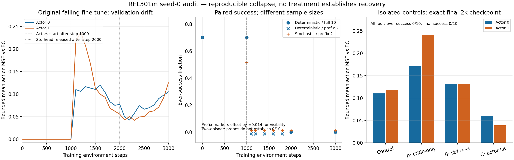

# Phase 3 baseline reproduction and stabilization audit

The historical BC-assisted seed-0 collapse is reproduced, not repaired. New model tensors match the historical run bitwise at steps 1,000, 2,000 and 3,000. The first 100 actor updates already produce large deterministic action drift; the paired ten-episode evaluation falls from 7/10 ever-success at step 1,000 to 0/10 at step 2,000. All isolated 2k treatments also end at 0/10. No learning improvement or readiness for a 300k pilot is established.



## Provenance and preservation

Measured on 2026-10-02. Branch: `codex/stabilize-baseline-repro`, based on main `6bc872c13830a7ee1e105f6fd717a63837c66eee`.

- `e4a2b1c`: preserves the previously unpublished local fine-tune implementation/configs used by the failing run. Historical source hashes were checked before instrumentation.
- Reproduction source: `49618a4c2766a0012f98361ff4b1990e7bebf47e`.
- Isolated treatment source and final full test suite: `8df5c38ecd1d75a872db61daff2638c2d3520212`. Later changes only package documentation/evidence.
- BC checkpoint: `experiments/phase3/bc_seed42/best.pt`; SHA-256 `8e88e30e4d9ec87a462596a46c7aa5fd1e83d7ac51b0bfcfd3f595c380273979`.
- Train split: 30 demonstration episodes / 6,000 transitions. Validation: five episodes; test: five episodes, excluded from gradients, diagnostics and selection. The fixed diagnostic subsets contain 256 train and 256 validation transitions, with indices recorded per run.
- SHA verification checked 90 protected historical files: the original 10k fine-tune directory, input BC checkpoint and demonstration dataset. None changed. Original MASAC/pilot/environment configs and Phase 1/2 contract artifacts are unchanged; fine-tune configs match their preserved local version.

Stack: Python 3.10.12, robosuite 1.5.2, MuJoCo 3.9.0, NumPy 1.26.4, PyTorch 2.7.1+cu128, TensorBoard 2.20.0. Two Panda robots, opposed TwoArmLift, 20 Hz, horizon 200; state-only observations and native reward/success/time-limit semantics remain intact. Live dimensions: actor observations 66 each; actions 7 each; critic state 119; joint action 14. No dependencies or collision geometry changed.

Selected public evidence is in [results.json](evidence/stabilize_baseline_repro/results.json), the run CSV/JSON subdirectories, [verification manifest](evidence/stabilize_baseline_repro/SHA256SUMS.json) and the [PDF figure](evidence/stabilize_baseline_repro/diagnostic_overview.pdf). Checkpoints, demonstrations, complete logs and TensorBoard remain local under ignored `experiments/` and `data/`. Exact historical reproduction requires the recorded local dataset/checkpoint; retraining BC from a fresh clone does not guarantee this checkpoint hash.

## BC before optimizer updates

Full evaluations use the same ten initial states, seed 20,000, sequence SHA `19841a3401962f77201c881bd1c5865b19aa9a104e7c42c02926d6ccedfd7721`.

| Policy distribution | Mean return | Ever-success | Final-success |
| --- | ---: | ---: | ---: |
| Raw loaded BC, deterministic | 30.848067 | 7/10 | 2/10 |
| Raw loaded BC, stochastic | 4.320495 | 0/10 | 0/10 |
| Configured BC, initial log_std −3, stochastic | 24.672198 | 3/10 | 1/10 |

Raw checkpoint evaluation precedes all optimizer updates and optional std overrides. The controlled std changes stochastic behavior while deterministic actions remain identical. Early stochastic evaluations use the first two initial states, a separate prefix SHA, and are kept separate from full ten-episode rates.

## Reproduce the failing fine-tune

This reproduction retains the existing combined demo-prefill/BC-loss method, including 1,000 offline Q updates, 1,000 online actor-freeze updates, lambda_BC=0.5 and a fixed-std window through the first 3,000 Q updates. It is distinct from plain MASAC.

| Environment steps | Q optimizer calls | Actor calls, each | Alpha calls | Return | Ever / final success |
| --- | ---: | ---: | ---: | ---: | --- |
| 1,000 | 2,000 | 0 | 0 | 30.848067 | 7/10 / 2/10 |
| 2,000 | 3,000 | 1,000 | 1,000 | 2.172557 | 0/10 / 0/10 |
| 3,000 | 4,000 | 2,000 | 2,000 | 0.756812 | 0/10 / 0/10 |

`step=1000 updates=2000` is therefore expected: 1,000 offline plus 1,000 online critic updates. It does not mean 2,000 actor steps. Each Q call updates both critics; each alpha call updates both temperatures; actor total is twice the per-actor count. Counters were checked against checkpoint Adam states. The [1k check](evidence/stabilize_baseline_repro/reproduction_1k_check.json) and [3k check](evidence/stabilize_baseline_repro/reproduction_3k_check.json) verify bitwise equality of all model tensors against historical checkpoints.

Validation diagnostics use bounded-action MSE on the same fixed 256-transition subset. Drift compares the deterministic actor against the original BC actor; expert MSE compares against demonstration actions.

| Steps / actor updates each | BC drift, actor 0 / 1 | Expert MSE, actor 0 / 1 |
| --- | --- | --- |
| 1,000 / 0 | 0 / 0 | 0.000936 / 0.000373 |
| 1,100 / 100 | 0.109910 / 0.215775 | 0.110881 / 0.215623 |
| 1,200 / 200 | 0.105951 / 0.237434 | 0.107083 / 0.237608 |
| 2,000 / 1,000 | 0.077094 / 0.055438 | 0.077417 / 0.056065 |
| 3,000 / 2,000 | 0.105067 / 0.125445 | 0.105577 / 0.125912 |

At step 1,100 both deterministic and stochastic early probes fail on 0/2 successes. This localizes drift within the first 100 actor updates; it does **not** establish the full 0/10 rate at that point or degradation after one update. The std output is still fixed at −3 during those updates, so std-head learning alone cannot explain the deterministic collapse.

## Isolated A/B/C diagnostics

These use a separate plain BC-initialized MASAC short control: no prefill/BC loss, no offline pretraining, no std freeze. The common warmup=0 deviation is explicit; the original 10k warmup/default config is unchanged. First update occurs at environment step 256 with batch size 256. Each treatment changes one factor relative to that control. Training seed, source, checkpoint, fixed eval states and other hyperparameters match. A has fewer actor updates deliberately.

| Completed 2k run | Q calls | Actor calls each / alpha | Return | Ever / final | Exact final validation BC drift, actor 0 / 1 |
| --- | ---: | --- | ---: | --- | --- |
| Control | 1,745 | 1,745 / 1,745 | 14.433711 | 0/10 / 0/10 | 0.110422 / 0.117895 |
| A: critic-only 1,000 updates | 1,745 | 745 / 745 | 1.593137 | 0/10 / 0/10 | 0.170472 / 0.240694 |
| B: initial log_std −3 | 1,745 | 1,745 / 1,745 | 8.130529 | 0/10 / 0/10 | 0.131537 / 0.132310 |
| C: actor lr 3e−5 | 1,745 | 1,745 / 1,745 | 14.579549 | 0/10 / 0/10 | 0.060318 / 0.039038 |

For A, actor SHA and alpha stay unchanged through 1,000 Q-only updates; the first actor update is at environment step 1,256. Its step-1k deterministic evaluation still matches BC. B changes only the std output rows and then allows std learning. C keeps critic lr 3e−4. C's smaller measured action drift has not translated into success recovery; one seed and ten episodes do not establish general performance differences.

The final drift values above are recomputed from the exact final checkpoint. Periodic diagnostic CSVs for these runs end at step 1,955, so their last drift rows are not substituted for step-2k values. No new combined treatment was introduced. Existing BC retention remains a separate method with explicit sampling ratios/BC coefficient.

## Learner audit and explanation limits

No demonstrated SAC Bellman/entropy/temperature/scaling/timeout/isolation/target-update bug was found. Tests and derivation are documented in the [protocol](stabilize_baseline_protocol.md). The corrected issues are ambiguous update reporting, missing raw stochastic pre-update evidence, insufficient early drift probes and missing explicit isolated controls; the reproduced learner formulas were not changed.

BC has no direct log_std supervision: std head gradients are zero for its mean-action objective. Shared hidden features can still change std outputs indirectly. A fresh optimizer test distinguishes that from accidental std training. Warm-start regression checks deterministic equality and stochastic differences.

The original sequential actor order remains: actor 1 sees the already-updated actor 0. No record establishes that this was intentional or that it caused collapse. Its behavior is locked by a test; a simultaneous snapshot would constitute a separate learner change.

A read-only [gradient decomposition](evidence/stabilize_baseline_repro/gradient_decomposition.json) at historical step 1,000, on a fixed train-demo batch, gives L2 norms:

| Component | Actor 0 | Actor 1 |
| --- | ---: | ---: |
| Negative-Q objective | 17.0884 | 32.6569 |
| Entropy objective | 0.3835 | 0.4073 |
| Weighted BC objective, lambda=0.5 | 0.0107 | 0.0181 |

No optimizer step was executed. Demonstration sampler seed is 0; stochastic Torch probe seed is 42. This is not the historical optimizer minibatch. Q-gradient dominance suggests investigating early Q gradients versus retention, but gradient norms alone do not prove target bias, an implementation bug or Adam's actual parameter displacement. No new coefficient is claimed to solve it.

## Validation, compute and simulator blocker

`PYTEST_DISABLE_PLUGIN_AUTOLOAD=1 .venv-phase3/bin/python -I -m pytest -q tests` completed: **155 passed in 74.84s**, including Phase 0/1/2 regression, SAC audit, information isolation, checkpoint compatibility and the existing 1,000-step training integration with 745 learner updates exercising Q, actors and alpha. The separate BC reproduction integration completed 1,000 steps with correctly frozen actors/alpha. Tests for the existing BC-assisted method exercise its BC loss and unfrozen updates.

All six new runs completed with zero NaN, Inf and action-bound violations. Total training environment steps: 12,000. They include 2,000 additional offline Q updates across the two reproduction runs; evaluation steps and prior demonstration/BC compute are additional. Per-run timing/peak allocated CUDA memory is retained in `results.json`; evaluation dominates the short reproduction run's wall time. These timings are not a 300k throughput benchmark.

The saved MuJoCo failure pose was reproduced again on the unchanged stack using `mj_forward`: box-box pair (150,153), right gripper finger pads, returned 10 contacts where the native invariant permits 8. [Diagnostic JSON](evidence/stabilize_baseline_repro/collision_reproduction.json) records `status: reproduced`, `collision_fix_verified: false`. Increasing generic contact memory or treating `mj_maxContact` as an XML setting does not repair this failure. No simulator error is filtered or resumed silently.

Exact commands, filenames, counters and observer semantics are in the [run protocol](stabilize_baseline_protocol.md). Full local outputs are separate `experiments/phase3/stabilize_*` directories. Collision reproduction and the gradient probe are diagnostics, not resume or further training:

```bash
# Run from repository root; these commands require the existing historical artifacts.
.venv-phase3/bin/python -I scripts/reproduce_collision.py \
  --run-dir experiments/phase3/bc_pilot_20261002T094730Z/seed0 \
  --output experiments/phase3/stabilize_baseline_audit/collision_reproduction.json

.venv-phase3/bin/python -I docs/evidence/stabilize_baseline_repro/gradient_probe.py

.venv-phase3/bin/python -I docs/evidence/stabilize_baseline_repro/verify_reproduction.py \
  --historical-dir experiments/phase3/bc_finetune_10k_seed0 \
  --reproduction-dir experiments/phase3/stabilize_repro_3k --steps 1000 2000 3000
```

Audit/testing gates pass and the collapse is localized. Learning recovery and the collision repair remain unresolved. No 300k × 3 experiment was run or recommended, and the branch is submitted as a draft without merging.
